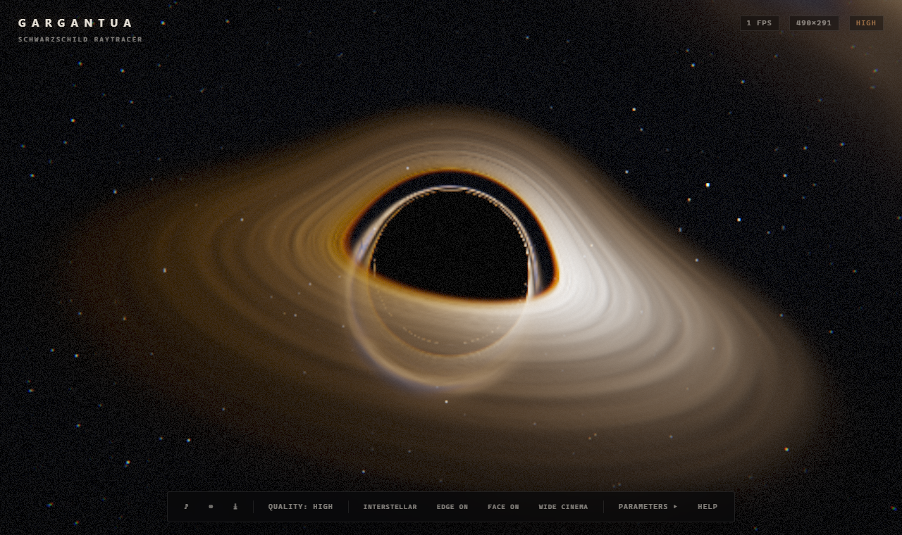

# GARGANTUA — Schwarzschild Black Hole Raytracer

A real-time, physically-grounded Schwarzschild black hole raytracer with a
**volumetric accretion disk**, built from scratch in **TypeScript + GLSL ES 3.00
+ WebGL2** and locally-vendored **Three.js** (used for math, camera & OrbitControls).

No black-circle sprites, no textures, no videos: every pixel is produced by
integrating the null geodesic ODE *in the fragment shader*.



## Features

| Area | Details |
|---|---|
| Geodesics | `d²x/dλ² = −(3/2)·rs·h²·x/\|x\|⁵` integrated with **RK4** and adaptive, distance-proportional stepping (validated vs Einstein deflection to <0.001 rad) |
| Horizon | r < rs → captured (true black) |
| Photon ring | Emerges naturally at r = 1.5 rs |
| Disk | **Volumetric** 3-D density field: radial profile ∝ r⁻¹·¹⁵, gaussian vertical profile, sharp ISCO edge, soft outer fade |
| Turbulence | FBM clouds advected by **Keplerian differential rotation** (shear) — live animation |
| Doppler | `g = √(1−1.5·rs/r) / (1−β·cosχ)` — exact invariant; beaming `I ∝ g^n`, temperature shift `T·g` |
| Redshift | Gravitational redshift of blackbody color & intensity (strength slider) |
| Lensing | Multiple disk crossings (primary/secondary/tertiary) plus full sky lensing |
| Sky | Procedural 3-layer starfield + FBM **milky-way band** with dust lanes |
| Post | HDR **bloom** (bright-pass + gaussian), **ACES** tonemap, chroma, vignette, grain, exposure |
| FX | Cinematic letterbox loop, 4 view presets, 21+ parameter HUD, mobile layout |
| Quality | Standard / High / Cinematic (resolution scale + ray budget + noise octaves), adaptive DPR cap |
| Persistence | All params + quality stored in `localStorage` |
| Automation | `window.GARGANTUA` API + `?shot=1&frames=N` URL screenshot |

## Physics validation (tools/*.py)

| Test | Result |
|---|---|
| Vector ODE vs Binet `u''+u=1.5·rs·u²` vs Christoffel integration | agree ≤1e-3 (interp. limit) |
| Vector ODE vs exact deflection integral | |Δb=4.0 → **1.4e-6 rad** |
| Doppler formula vs exact invariant `1/(uᵗ−b·u^φ)` | **3.6e-16** (machine precision) |
| Local-frame cosine (`(1-rs/r)^-1/2`) vs alternative | -1/2 **correct**; +1/2 off by 8.5% |
| Adaptive step scheme (Standard/High/Cinematic) | max ~2e-4 rad error @ 75–162 avg steps |

## Run

```bash
# 1. build (TS → ES modules)
npm run build          # or: npm run watch

# 2. serve statically (no build step required to serve)
npm start              # → http://localhost:8123
# or plain:  python -m http.server 8123
```

Then open <http://localhost:8123>.

Optional asset regen:

```bash
npm run audio          # regenerate assets/ambient.wav (python + numpy)
npm run verify         # re-run physics verification (doppler + deflection)
npm test               # headless acceptance suite (system Chrome + puppeteer-core)
```

## Controls

| Key | Action |
|---|---|
| Drag / Wheel / R-Drag | Orbit / Zoom / Pan |
| `1–4` | View presets |
| `0–9` | Debug views (0 composite, 1–3 crossing orders, 4 sky-only, 5 disk-only, 6–8 diagnostics, 9 no-post) |
| `C` | Cinematic letterbox loop |
| `S` | Save PNG |
| `Q` | Cycle quality |
| `P` | Parameters panel |
| `M` | Ambient music |
| `R` | Reset camera |
| `?` | Help |

## URL API

```
?quality=high&preset=2&view=3&shot=1&frames=20&diskTemp=9000&exposure=1.2
```

Any parameter id from `params.ts` can be overridden in the URL.
`?shot=1&frames=N` renders N frames then dispatches `gargantua-shot` and
sets `window.__GARGANTUA_SHOT__` (dataURL) — used by the test suite and CI.

```js
window.GARGANTUA.setParam('diskTemp', 12345)
window.GARGANTUA.getParams()
window.GARGANTUA.setView(4)
window.GARGANTUA.setQuality('cinematic')
window.GARGANTUA.snap()   // dataURL
```

## Structure

```
index.html          entry + DOM
css/style.css       HUD / cinematic styling
src/
  main.ts           bootstrap, loop, URL API
  engine.ts         WebGL2 pipeline: raytrace → bright → blur → composite
  shaders.ts        GLSL: geodesic integrator + volumetric disk + procedural sky
  postshaders.ts    GLSL: bloom + ACES + CA + vignette + grain
  camera.ts         OrbitControls rig, presets, cinematic path
  params.ts         21+ parameter registry, quality tiers, persistence
  hud.ts            DOM HUD & sliders
  audio.ts          WebAudio ambient music player
  reliability.ts    context loss / black-frame recovery
vendors/            three.module.js + OrbitControls (vendored, offline)
assets/ambient.wav  generated dark ambient pad (28 s, loopable)
tools/              python physics validators + audio generator
test/run-tests.mjs  headless acceptance suite (14 checks)
```

## Test results

`npm test` — 14/14 checks pass (verified with system Chrome, SwiftShader):

```
✅ page loads                    ✅ zero console errors
✅ zero page errors              ✅ zero failed requests
✅ frame is not black            ✅ scene content present
✅ 4 presets                     ✅ 3 quality tiers
✅ debug views 0–9               ✅ param set/get
✅ params persist across reload  ✅ URL shot API
✅ cinematic letterbox           ✅ FPS meter alive
```

Screenshots are written to `shots/` during the run.

## Notes on the physics (why it's "real")

* The ODE integrates the exact Schwarzschild null geodesic in Cartesian-like
  isotropic coordinates; **h² = |x × v|²** is the conserved specific angular
  momentum, which makes the form `−3/2·rs·h²·x/r⁵` exact (derivable from the
  Binet equation, see `tools/verify_geodesic2.py`).
* Doppler at each disk sample uses the photon direction measured in the local
  static frame — the `(1−rs/r)^−1/2` radial scale factor is verified exactly.
* The disk brightness uses a blackbody source function ∝ `B(T_obs)·g^n` with
  `T_obs = g·T(r)`; this produces the classic asymmetric "approaching side
  bright blue / receding side dim red" look automatically.

## License

MIT — do what you want, keep the physics honest. 🕳️